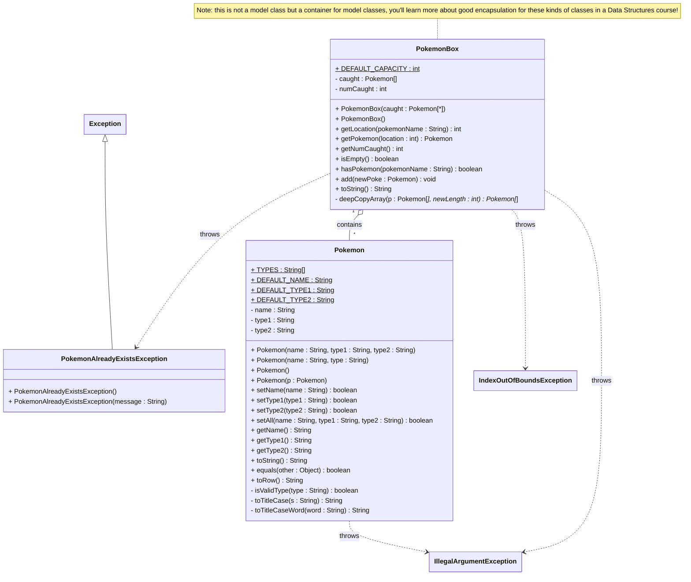

# **PokémonBox + Exceptions**
Welcome to the wonderful world of Pokémon! We want to keep the world wonderful, but due to climate change and the impact human beings have had on habitat loss we've had to make changes. Our Pokémon world region has decided that to accomplish this, **Pokémon trainers will only be allowed to keep one type of each Pokémon**.

The Pokémon Box technology needs upgrading, the code provided does not limit the addition of Pokémon with the same name. Create a custom exception class, called `PokemonAlreadyExistsException` that can be thrown when the `add` method in `PokemonBox`. The constructors also need upgrading to throw an exception, rather than shutdown the program. An `IllegalArgumentException` should be used in the `Pokemon` class constructors.

## UML Diagram
Note the following UML diagram is of the *completed* project. This can help you understand the provided code but note that the differences/missing parts from it are described in the requirements section below.


## **List of Requirements:**
- `Pokemon.java`:
  - Upgrade constructors to throw `IllegalArgumentException`, rather than shutdown the program
- `PokemonBox.java`:
  - Upgrade constructors to throw `IllegalArgumentException`, rather than shutdown the program
  - Upgrade `getPokemon` method to throw `IndexOutOfBoundsException` for illegal `location` value
  - Upgrade `add` method to throw `PokemonAlreadyExistsException` when the name of the provided Pokemon already exists in the array
    - Make sure to create the `PokemonAlreadyExistsException` class first!
- `Main.java`:
  - Upgrade the driver (menu program) to handle the following exceptions:
    - `InputMismatchException`: Allow the user to reenter a valid option (as an integer)
    - `IllegalArgumentException`: Allow the user to reenter valid data for Pokemon data
    - `PokemonAlreadyExistsException`: Allow the user to try again,reminding them that our regions sustainability efforts in reducing habitat loss and environmental impacts requires a max of 1 of the same type of Pokémon in the Box.

## **Sample Working Screenshots:**
*Note that your output may differ from the examples shown below, as long as it fulfills the requirements above and the output is clean you have creative liberty on how you provide feedback to the user.*


Start of menu program:
```
Preloading Pokemon Box...
...Done!

---------------------------
| Welcome to Pokemon Box! |
---------------------------

This box has 6 Pokemon, which are:
    01. Pikachu [Electric]
    02. Bulbasaur [Grass - Poison]
    03. Charmleon [Fire]
    04. Squirtle [Water]
    05. Butterfree [Bug - Flying]
    06. Pidgeotto [Normal - Flying]

MAIN MENU
What would you like to do?
    1) Add a New Pokemon
    2) List All Pokemon
    3) Exit Program

Enter choice number>
```

Invalid integer choice error handling:
```
MAIN MENU
What would you like to do?
    1) Add a New Pokemon
    2) List All Pokemon
    3) Exit Program

Enter choice number> woops

Invalid choice, please pick a valid option as an integer.
```

Invalid Pokémon information error handling (should work similarly for illegal name or type):
```
MAIN MENU
What you would like to do?
    1) Add a New Pokemon
    2) List All Pokemon
    3) Exit Program

Enter choice number> 1

Enter Pokemon Info to be added:
Enter Pokemon Name> Scyther
Enter Pokemon Type #1> Buggy
Enter Pokemon Type #2 (none if no second type)> none

Invalid name or types for Pokemon entered. Please make sure types are valid (or enter 'none' for type 2).

Here’s the list of valid types to help:
[Normal, Fire, Fighting, Water, Flying, Grass, Poison, Electric, Ground, Psychic, Rock, Ice,
Bug, Dragon, Ghost, Dark, Steel, Fairy]
```

Invalid add to PokemonBox error handling (already exists):
```
MAIN MENU
What would you like to do?
    1) Add a New Pokemon
    2) List All Pokemon
    3) Exit Program

Enter choice number> 1

Enter Pokemon Info to be added:
Enter Pokemon Name> Squirtle
Enter Pokemon Type #1> Water
Enter Pokemon Type #2 (none if no second type)> none

ERROR! Pokemon already exists in box!
Please remember our regions sustainability efforts in reducing habitat loss and environmental impacts.
If you'd like to learn more, please go to https://youtu.be/GwafCvCeE-w
```

Valid Pokémon added successfully:
```
MAIN MENU
What would you like to do?
    1) Add a New Pokemon
    2) List All Pokemon
    3) Exit Program

Enter choice number> 1

Enter Pokemon Info to be added:
Enter Pokemon Name> Mewtwo
Enter Pokemon Type #1> Psychic
Enter Pokemon Type #2 (none if no second type)> none

Mewtwo added!

MAIN MENU
What would you like to do?
1) Add a New Pokemon
2) List All Pokemon
3) Exit Program

Enter choice number> 2

This box has 7 Pokemon, which are:
    01. Pikachu [Electric]
    02. Bulbasaur [Grass - Poison]
    03. Charmleon [Fire]
    04. Squirtle [Water]
    05. Butterfree [Bug - Flying]
    06. Pidgeotto [Normal - Flying]
    07. Mewtwo [Psychic]
```

Exiting program option:
```
MAIN MENU
What would you like to do?
    1) Add a New Pokemon
    2) List All Pokemon
    3) Exit Program

Enter choice number> 3

Thank you for using the Pokemon Box program :D see you later!
```
